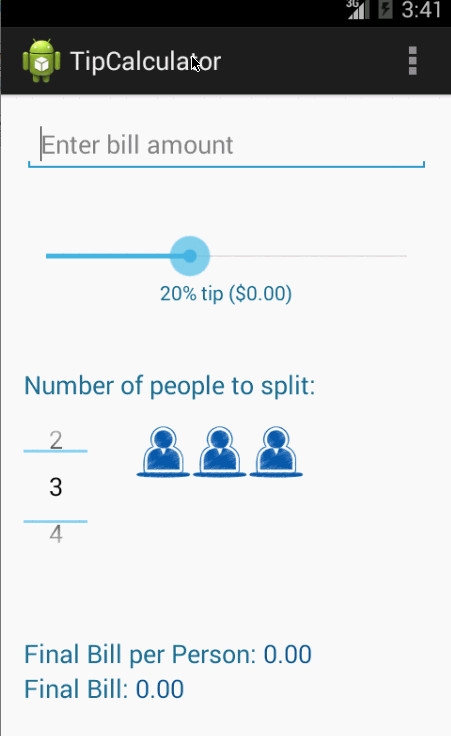

TipCalculator
====================

Simple Tip Calculator that allows users to split a check amount including tip.

Features:
- Allows users to enter total check amount
- Allows uesrs to select cuustom tip amount
- Allows users to select custom number of people to split check with 
- Displays final amount of check
- Display final amount to pay per person

